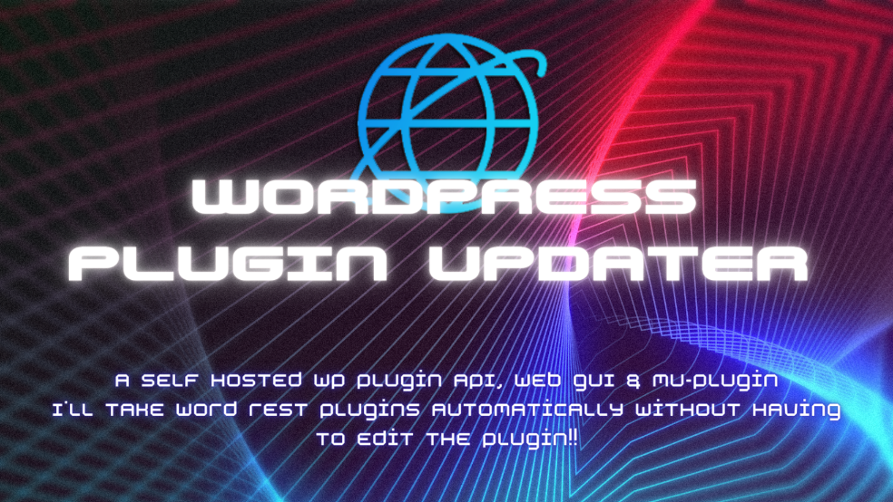

# v-wordpress-plugin-update-api
WordPress MU-Plugin, PHP api and Web GUI to update plugins from your own server.

## What This Is
This is a WordPress mu-plugin (must-use plugin) along with a PHP API and Web GUI that allows you to update your WordPress plugins from your own server.

The mu-plugin iterates through all installed plugins and sends the domain, security key, plugin slug and version to the API.

The API compares the domain and key to a list in the HOSTS file. If the domain exists and the key matches, it checks the plugins against files in the /plugins directory, for example, `plugin-slug_1.0.0.zip`. If a new version is available the API sends the filename to the mu-plugin which in return sends a request to downloads.php with the domain, security key and plugin file. The download.php file grabs the plugin file from outside the webroot (for security) and passes it to the mu-plugin to be updated.

We have also added a web admin to the API for better user experience. Add, remove or edit domains and security keys. As well as upload and delete plugin file.

You can customize the GUI by editing the CSS in the static folder and by swapping out the logo image.

## Who This Is For
There are several great usage cases for this system. Our self-hosted API/Web GUI + MU-Plugin offering unique way of updating WordPress plugins without using the official repository.

One of the main benefits here is you do not have to edit any code in a plugin. Unlike the other ones available. This is great for a compatibility and ease of use.

This system is mostly geared to web developers and web designers who may want to push out updates to custom plugins without sharing them in the official repository.

This can also allow you to edit existing plugins from the official repository and customize them. And push out a separate release once you've implemented or changes after updates to the official plugin.

Anyone who's using a plugin not from the official repository and who doesn't want to update each site manually when new releases arrive.

For anyone worried about supply chain attacks. Or just wants to intercept and test updates without having to then manually update many sites.

But most of all it's just much easier than any other option. You don't need to change code or anything just the name of the zip file upload it and you're done.

## Getting Started

### To Install In WP

- Drop in the MU-Plugin from the MU-Plugin directory to your sites.
- Set a key for security in the file.
- Set api.php url in the file.

### To Install On Server
- Upload the update-api drectorie contents to your webservers webroot.
- Change webroot to the /public/ directory.
- Open index.php and set username and password.

### Manage Update API
- Login to WebGUI at yourdomain.com/
- Add websites domain in format domain.com.
- Add websites security key that you used in mu-plugin.
- Prepare updates by renaiming the plugin zip file to plugin-slug_1.1.1.zip (pay attention to the formatting. First is the plug-in slug followed by an _ then the version.
- Delete any previous versions of plugging updates.
- Sites will update once daily.

## Using Web GUI
The Web GUI can have login name and password set in the index.php file.

The Web GUI is set into 2 sections. the first lets you add a host and key. The host is 'domain.com' & the key is 'anything'. You can add, edit or delete hosts and keys here.

The second section is plugins. This lets you upload plugins or delete them. As this is currently setup if you are adding a new update you must remove the old one for this to work. The plugins zip file should be the same as it would in the offical repo except for the naming. The plugin slug refers to the main plugin file before `.php`. The version is in standard format 1.1.1 Take the plug-in folder and add it to a zip archive with the name and the following format plugin-slug_1.2.1.zip.

## Project Status

### Change Log
3/10/23: Added download.php. This is the beginning of implementing security. The point will be to move the hosts file and the plugin directory outside of the webroot and have downloaded.php route the file requests after validating with the hosts file.

### To-Do List
- Polish GUI ( Needs some tweaks)
